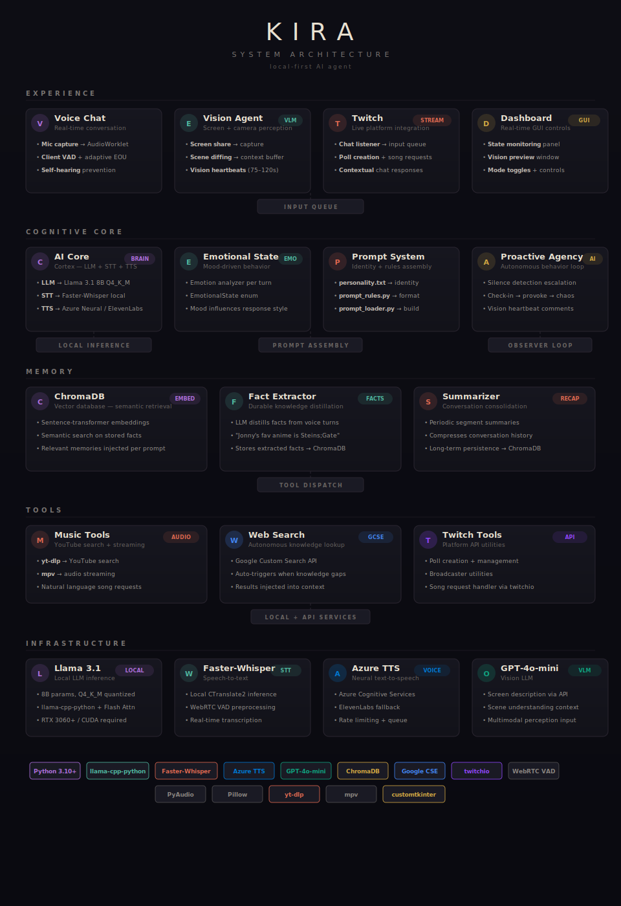

<h1 align="center">KIRA</h1>

<p align="center">
  <strong>A multimodal, memory-persistent AI agent that listens, sees, speaks, and acts — running entirely on local hardware.</strong>
</p>

<p align="center">
  <a href="#architecture">Architecture</a> · <a href="#setup">Setup</a> · <a href="#customization">Customization</a> · <a href="#roadmap">Roadmap</a>
</p>

<p align="center">
  
  
  
  
  
</p>

---

<p align="center">
  
</p>

---

Kira is not a chatbot. She is a real-time cognitive agent with long-term semantic memory, computer vision, voice interaction, and proactive autonomous behavior. She runs a local LLM on consumer GPU hardware, remembers facts about her user across sessions, watches the screen to understand context, and integrates with live platforms like Twitch — all without sending private data to the cloud.

This project demonstrates end-to-end systems design: real-time audio pipelines, vector-database memory architectures, multimodal sensor fusion, and agentic decision loops — built from scratch in Python.

---

## Architecture

<p align="center">
  
</p>

The system is organized into five layers:

**Experience** — Voice chat with real-time mic capture and VAD, a vision agent that watches the screen and injects context, Twitch integration for live streaming with chat/polls/song requests, and a customtkinter dashboard for real-time controls and state monitoring.

**Cognitive Core** — The AI core runs Llama 3.1 8B locally via llama-cpp-python with Flash Attention. An emotional state system drives mood-aware responses. The prompt system assembles identity from `personality.txt`, formatting rules, and memory context. A proactive agency loop monitors silence and escalates through behavioral stages autonomously.

**Memory** — ChromaDB stores extracted facts (not raw transcripts) as sentence-transformer embeddings. The fact extractor uses the LLM itself to distill durable knowledge from conversation and the summarizer periodically compresses conversation segments. Relevant memories are injected into each prompt via semantic retrieval.

**Tools** — Music playback via yt-dlp and mpv on natural language request. Autonomous web search through Google Custom Search API when knowledge gaps are detected. Twitch API utilities for poll creation and broadcaster tools.

**Infrastructure** — Llama 3.1 8B (Q4_K_M) for local reasoning, Faster-Whisper for speech-to-text, Azure Neural TTS (with ElevenLabs fallback) for voice output, and GPT-4o-mini for vision/screen understanding.

---

## What Makes This Interesting

### Local-First Inference

Runs Llama 3.1 (8B, Q4_K_M) entirely on-device via `llama-cpp-python` with Flash Attention enabled. No API calls for core reasoning — conversations stay private and latency stays low.

### Persistent Semantic Memory

A ChromaDB vector database stores extracted facts across sessions. The memory extractor uses the LLM itself to distill durable knowledge from conversation ("Jonny's favorite anime is Steins;Gate") and injects only relevant memories into each prompt via semantic retrieval.

### Multimodal Perception

A Vision Agent captures the screen, describes it via GPT-4o-mini, and injects that context into the cognitive stream. The agent understands whether you're coding, gaming, or watching a video — and adapts accordingly.

### Full Voice Pipeline

Real-time Voice Activity Detection (WebRTC VAD) → Faster-Whisper transcription → LLM reasoning → Azure Neural TTS speech output. Includes self-hearing prevention, interruption handling, and TTS rate limiting.

### Proactive Agency

Kira doesn't just respond — she initiates. A background observer loop monitors silence duration and escalates through behavioral stages (casual check-in → provocation → chaos). Vision heartbeats let her comment on what she sees without being asked.

### Platform Integration

Twitch chat reading and contextual responses, poll creation, song requests via YouTube search and mpv streaming, and autonomous Google queries when she doesn't know something.

---

## Project Structure

```
Kira/
├── bot.py                  # Orchestrator — event loop, VAD, input queue, brain worker
├── ai_core.py              # Cortex — LLM inference, STT, TTS, prompt assembly
├── memory.py               # Hippocampus — ChromaDB interface, semantic retrieval
├── memory_extractor.py     # Fact extraction — distills durable facts from conversation
├── summarizer.py           # Consolidation — summarizes conversation segments into memory
├── vision_agent.py         # Eyes — screen capture, VLM description, context buffer
├── dashboard.py            # GUI — real-time controls, vision preview, state monitoring
├── game_mode_controller.py # Mode toggle — toggles vision observer mode on/off
├── twitch_bot.py           # Twitch client — chat listener, song request handler
├── twitch_tools.py         # Twitch API — poll creation, broadcaster utilities
├── music_tools.py          # DJ — YouTube search and mpv audio streaming
├── web_search.py           # Search — Google Custom Search API wrapper
├── persona.py              # Emotional state — mood enum that influences response style
├── personality.txt         # Identity — natural language personality prompt
├── personality_file.py     # Personality loader utility
├── prompt_rules.py         # Formatting rules — output constraints and tool tag definitions
├── prompt_loader.py        # Prompt builder — assembles full prompt from components
├── config.py               # Configuration — all settings loaded from .env
├── requirements.txt        # Python dependencies
└── .env.example            # Environment variable template
```

---

## Setup

### Prerequisites

- Python 3.10+
- NVIDIA GPU (RTX 3060+ recommended) with CUDA drivers
- [Visual Studio Build Tools](https://visualstudio.microsoft.com/visual-cpp-build-tools/) (C++ tools, required for `llama-cpp-python`)
- `mpv` installed and on PATH (for music playback)

### Quick Start

```bash
git clone https://github.com/JonathanDunkleberger/Kira.git
cd Kira
pip install -r requirements.txt
```

Download a GGUF model (e.g., [`Meta-Llama-3.1-8B-Instruct-Q4_K_M`](https://huggingface.co/)) and place it in `models/`.

```bash
cp .env.example .env    # Fill in your API keys
python dashboard.py      # Launch the GUI + bot
```

---

## Environment

| Variable | Purpose |
|---|---|
| `LLAMA_MODEL_PATH` | Path to your local GGUF model file |
| `AZURE_SPEECH_KEY` | Azure Cognitive Services TTS |
| `AZURE_SPEECH_REGION` | Azure region (e.g., `eastus`) |
| `ELEVENLABS_API_KEY` | ElevenLabs TTS fallback (optional) |
| `OPENAI_API_KEY` | GPT-4o-mini for vision agent |
| `GOOGLE_CSE_API_KEY` | Google Custom Search for web queries |
| `GOOGLE_CSE_ID` | Custom Search Engine ID |
| `TWITCH_TOKEN` | Twitch bot OAuth token |
| `TWITCH_CLIENT_ID` | Twitch API client ID |
| `TWITCH_CHANNEL` | Twitch channel to join |

See `.env.example` for the full list.

---

## Customization

| What | Where | How |
|---|---|---|
| Personality and backstory | `personality.txt` | Edit the natural language prompt directly |
| Emotional states | `persona.py` | Add/modify the `EmotionalState` enum |
| Output formatting rules | `prompt_rules.py` | Adjust constraints (length, style, tool tags) |
| All runtime settings | `.env` | API keys, model paths, TTS engine, feature flags |

---

## Roadmap

- [ ] **GraphRAG** — Graph-based memory for richer relationship tracking between facts
- [ ] **Local Vision** — Replace API vision with a quantized LLaVA model for full offline capability
- [ ] **Live2D Integration** — WebSocket bridge to drive avatar expressions from emotional state
- [ ] **Multi-agent Reasoning** — Separate planning and execution into cooperative agent threads

---

## License

MIT
