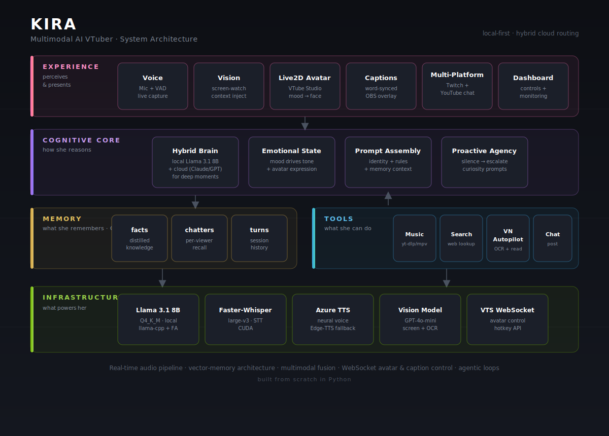

<h1 align="center">KIRA</h1>

<p align="center">
  <strong>A multimodal, memory-persistent AI VTuber that listens, sees, speaks, emotes, and streams — built on a hybrid-cloud cognitive architecture.</strong>
</p>

<p align="center">
  <a href="QUICKSTART.md">Quick Start</a> · <a href="#architecture">Architecture</a> · <a href="#setup">Setup</a> · <a href="#customization">Customization</a> · <a href="#roadmap">Roadmap</a>
</p>

<p align="center">
  
  
  
  
  
  
  
  
  
</p>

---

<p align="center">
  
</p>

---

Kira is not a chatbot. She is a real-time cognitive agent with long-term semantic memory, computer vision, full voice interaction, mood-driven Live2D expressions, on-screen synced captions, live chess on Lichess, and proactive autonomous behavior. Her senses are fully local — two CUDA Whisper instances on-device, WebRTC VAD, real-time screen capture — while reasoning is hybrid-cloud by design: Groq for triage and fast paths, Claude Sonnet streaming live during voice turns, Claude Opus for deep moments. She remembers facts about her user across sessions, watches the screen to understand context, drives a Live2D avatar from her emotional state, co-hosts live streams across Twitch and YouTube, and plays rated chess as a Lichess bot account — and, as of July 2026, has beaten Pokémon FireRed start-to-credits fully autonomously.

This project demonstrates end-to-end systems design: real-time audio pipelines, vector-database memory architectures, multimodal sensor fusion, WebSocket-driven avatar control, synced caption rendering from TTS word-timing, and agentic decision loops — built from scratch in Python.

> **Fork this — make your own VTuber.** Kira is a framework, not just one character. Swap the persona, voice, and avatar and she becomes yours. New here? Start with the [15-minute QUICKSTART.md](QUICKSTART.md), then come back for the deep dives below.

---

## Milestone — she beat Pokémon FireRed by herself

On **July 15, 2026**, Kira played Pokémon FireRed from a brand-new save file to the end credits — **8 badges, Victory Road, the Elite Four, the Champion — with zero human input.** No scripted routes, no mid-run fixes, no reloads. She caught and evolved her own team, refused to enter the League until the whole squad was ready, got knocked flat by the Champion's gauntlet, healed, restocked with her own prize money, and walked back in until she won.

> "...that's it. that's the whole thing. eight badges, the Elite Four, the Champion — I actually did it. we did it."
> — Kira, the first time the credits rolled

| | |
|---|---|
| **Result** | Fresh save → 8 badges → Elite Four → **Champion → credits** |
| **Human input** | **Zero** — no code changes, no resumes, no touches, the entire run |
| **Wall clock** | 6h 08m headless at ~14x speed (~86 human-hours of gameplay) |
| **Battles / decisions** | 3,850 real battles · 353 strategic decisions |
| **Stability** | 0 crashes across a 200,000-line run log |
| **Final team** | Venusaur 87 · Lapras 65 · Raticate 62 · Arbok 62 · Kadabra 62 · Dugtrio 61 — all acquired in-run |

The honest footnote: she entered the League at the minimum readiness bar and the gauntlet flattened her eight times. Her self-funded recovery loop (heal → restock → re-enter) ground it out, and the eleventh career fight against her rival was the one that made her Champion. I wouldn't trade that arc for a clean sweep.

**How it works:** live RAM reads for game state (vision is for vibes, RAM is for truth), a learned warp-graph world model with BFS travel, an E4-readiness gate and ace-cap that force a balanced team instead of a solo carry, and the same soul/oracle layer that runs the rest of Kira making every decision in character. Receipts: [`RUN_STATS_fresh_go_6.md`](docs/RUN_STATS_fresh_go_6.md) · Deep dive: [`pokemon_agent/AUTONOMOUS_GAME_HARNESS.md`](pokemon_agent/AUTONOMOUS_GAME_HARNESS.md)

**Try it:** the harness lives in [`pokemon_agent/`](pokemon_agent/). Bring your own legally obtained ROM — no ROM, saves, or Nintendo assets exist in this repo or anywhere in its history.

---

## Architecture

<p align="center">
  
</p>

The system is organized into five layers:

**Experience** — Voice chat with real-time mic capture and WebRTC VAD; a vision agent that watches the screen and injects context; a Live2D avatar (VTube Studio) whose facial expressions are driven by Kira's emotional state; Neuro-style on-screen captions synced word-by-word to her speech; ambient desktop audio awareness (loopback transcription and media-watch) so she can react to what she's hearing on screen; multi-platform live integration across Twitch and YouTube; and a web dashboard for real-time controls and state monitoring (FastAPI control server + WebSocket `/state`, at `127.0.0.1:8766`).

**Cognitive Core** — Hybrid brain: Groq llama-3.1-8b-instant handles triage and fast classification paths (no VRAM cost); Claude Sonnet streams live during voice turns, interleaving LLM tokens with TTS for low latency; Claude Opus fires for deep moments and session artifacts. Local Llama 3.1 8B (Q4_K_M) is an optional fallback, not loaded by default (~6–7 GB VRAM saved). A single active-turn lock serializes all LLM→TTS turns across voice, reactions, and chat batches, with priority lanes (P0 voice / P1 reactions / P2 chat) and a stop-word interruption system. An emotional-state system drives mood-aware responses and avatar expressions. A proactive agency loop (the Universal Boredom Protocol) monitors silence and escalates through behavioral stages autonomously.

**Memory** — ChromaDB stores extracted facts (not raw transcripts) as sentence-transformer embeddings across `facts`, `chatters`, and `turns` collections. A flat-JSON identity store (`memory_db/identity.json`) holds permanent anchors — exact-lookup, not similarity search — for cross-platform identity resolution (e.g. the same person as a voice caller, a chat sender, and a Lichess opponent). The fact extractor uses Claude Haiku to distill durable knowledge from conversation; a speaker-attribution guard caps facts that can't be traced to the user's actual words (confidence floor 0.9). Session artifacts (lore entries + clip candidates) are generated via Sonnet at shutdown. Per-playthrough memory tracks narrative beats for VN sessions separately.

**Tools** — Music playback via yt-dlp and mpv on natural-language request; a web search module (present, not yet wired to a command); song identification from loopback audio (AudD fingerprinting); Twitch utilities (polls, predictions); a VN autopilot that OCRs the screen, reads visual-novel dialogue aloud in-character, and advances autonomously; a game-mode controller that adapts pacing and verbosity per activity; chess on Lichess (see below); and optional rate-limited chat posting.

**Infrastructure** — Groq llama-3.1-8b-instant (triage / fast paths) + Claude Sonnet/Opus (live voice + deep moments); Faster-Whisper distil-large-v3 on CUDA float16 — two instances, one for mic STT and one for desktop loopback; Azure Neural TTS (word-boundary timing for captions) with Edge-TTS fallback; Gemini for vision/screen understanding; Stockfish 17 for chess moves; VTube Studio WebSocket API for avatar control.

---

## What Makes This Interesting

### Local Senses, Hybrid Brain
Perception is fully on-device: two Faster-Whisper distil-large-v3 instances run on CUDA float16 — one for mic STT, one for desktop loopback — with WebRTC VAD for real-time end-of-speech detection. Reasoning is hybrid-cloud by design: Groq llama-3.1-8b-instant handles triage and fast classification (saving ~6–7 GB VRAM over the local path); Claude Sonnet streams live during voice turns, interleaving tokens with TTS output for minimal perceived latency; Claude Opus fires for the moments that need it. Local Llama 3.1 8B (Q4_K_M) is kept as an optional fallback, loadable lazily on first Groq failure.

### Turn-Taking Arbiter
A single asyncio lock serializes every LLM→TTS turn — voice, reactions, and chat batches never race each other. Priority lanes keep important turns from being buried: P0 is direct voice interaction, P1 is event-driven reactions (chess moves, highlights), P2 is the chat-batch worker. A pending-interjection queue holds P1 work with a TTL so stale reactions are discarded rather than spoken out of context. Stop-word interruption is name-addressed to avoid false positives from excited banter.

### Persistent Semantic Memory
A ChromaDB vector database stores extracted facts across sessions. Claude Haiku distills durable knowledge ("Jonny's favorite VN is Steins;Gate") and injects only relevant memories into each prompt via semantic retrieval. A speaker-attribution guard rejects facts that the model can't trace to the user's actual words — preventing Kira's own improvisations from laundering into high-confidence memory. Identity anchors live in a flat-JSON store for exact lookup (not similarity search), resolving the same person across mic voice, chat username, and Lichess opponent label.

### Multimodal Perception
A Vision Agent captures the screen, describes it via a vision model, and injects that context into the cognitive stream — so Kira knows whether you're coding, gaming, or watching anime, and reacts accordingly. A parallel audio agent loopback-transcribes desktop audio, identifies songs via AudD fingerprinting, and feeds ambient audio mood into the context stream.

### Full Voice Pipeline
Real-time WebRTC VAD → Faster-Whisper distil-large-v3 transcription → Groq/Claude reasoning → Azure Neural TTS output, with Claude Sonnet streaming tokens to TTS in parallel, self-hearing prevention, interruption handling, and salience filtering.

### Mood-Driven Live2D Expressions
Kira's emotional state (happy, sassy, moody, emotional, hyperactive) drives her Live2D avatar's facial expressions through the VTube Studio WebSocket API — code-driven, not webcam face-tracking. Expression mappings are per-model and auto-re-resolve when the avatar is swapped.

### Synced On-Screen Captions
Her spoken words appear on stream in a styled caption overlay, revealed word-by-word in sync with real Azure TTS word-boundary timing (not estimated). Rendered via a local WebSocket server into an OBS browser source. Bottom-anchored with auto-shrink for long lines, and a self-healing heartbeat auto-detects stale Azure word-boundary subscriptions over multi-hour streams and atomically rebuilds the synthesizer so captions recover without a restart.

### Chess on Lichess
Kira plays real rated games on Lichess as the bot account DuchessSterling, using berserk (the official Python client) + python-chess + a local Elo-capped Stockfish 17 to pick moves. Game events (opponent moves, clock, result) arrive as text and travel through the normal pipeline — she reacts in character and never narrates engine lines. Two-toggle consent design (Chess Mode + Accept Challenges, default-closed); supports one game at a time, resume-on-boot after crashes, full connection-loss retry lifecycle with exponential backoff, and spectate links for chat. Move evaluation and engine health surface to the dashboard chip (`♟ ENGINE FAILED`, `♟ CONNECTION LOST`, `♟ vs Name · move N · eval`).

### Autonomous VN Playthrough
A VN autopilot reads visual novels unattended — OCRs the dialogue (cloud OCR with local Tesseract fallback), speaks it in-character, interjects its own reactions and theories, advances the story, and maintains per-playthrough narrative memory — with graceful failsafes for menus and save prompts.

### Presence & Identity
Flat-JSON identity anchors hold permanent facts about known people — exact lookup, not similarity search — including cross-platform aliases (same person as a mic voice, a Twitch chat sender, and a Lichess opponent). Source attribution tags on all sensory input (`[VOICE — Jonny]`, `[GAME DIALOGUE]`, `[AMBIENT]`) prevent Kira from conflating what she heard from a game NPC with what her creator said. Salience filtering down-weights low-signal inputs before they reach the reasoning layer.

### Stream Intelligence
At session end, Sonnet generates lore entries and clip candidates from the full transcript. A running-bits tracker logs recurring jokes with callbacks; a called-shots ledger tracks predictions; a highlight extraction loop fires on an interval during game/VN sessions. Per-chatter memory stores personality tags and message history so returning viewers are recognized and callbacks land. A cookie jar / chaos-mode community meter accumulates viewer energy and can trigger community-wide chaos events.

### Proactive Agency
Kira initiates rather than only responding. A background observer loop (Universal Boredom Protocol) monitors silence and escalates through behavioral stages, and a curiosity system has her ask chat and her co-host unprompted questions to keep conversation alive.

### Multi-Platform Streaming
Reads and responds to chat across Twitch and YouTube simultaneously, building per-chatter memory so returning viewers are recognized.

---

## Project Structure

```
Kira/
├── run.py                            # Launcher — chdirs to repo root, then boots the bot (documented entrypoint)
├── kira/                             # Application package
│   ├── config.py                     # Configuration — all settings loaded from .env
│   ├── bot.py                        # Orchestrator — event loop, VAD, input queue, turn-taking arbiter, session artifacts
│   ├── brain/                        # Reasoning core
│   │   ├── ai_core.py                # Cortex — LLM inference, STT, TTS, prompt assembly, caption dispatch, Azure self-heal
│   │   ├── inference_router.py       # Inference backend selector — Groq vs local Llama, streaming, fallback
│   │   ├── groq_client.py            # Groq API wrapper (llama-3.1-8b-instant triage + fast paths)
│   │   ├── salience_filter.py        # Salience filtering — down-weights low-signal inputs before reasoning
│   │   ├── kira_state.py             # Shared bot state — serializable snapshot for dashboard /state endpoint
│   │   └── game_mode_controller.py   # Per-activity pacing / verbosity modes
│   ├── persona/                      # Personality & prompt assembly
│   │   ├── persona.py                # Emotional state — mood enum that influences response + expression
│   │   ├── personality_file.py       # Personality loader
│   │   ├── prompt_loader.py          # Prompt builder — assembles full prompt from components
│   │   ├── prompt_rules.py           # Formatting rules — output constraints and tool tag definitions
│   │   └── streamer_overlay.py       # Streamer overlay helpers
│   ├── senses/                       # Perception
│   │   ├── audio_agent.py            # Ears (desktop) — loopback audio transcription + reaction
│   │   ├── vision_agent.py           # Eyes — screen capture, VLM description, context buffer
│   │   ├── media_watch.py            # Lightweight ambient media awareness
│   │   └── loopback_transcriber.py   # WASAPI loopback capture + Whisper distil-large-v3 transcription
│   ├── memory/                       # Memory & logging
│   │   ├── memory.py                 # Hippocampus — ChromaDB interface, semantic retrieval, startup validation
│   │   ├── memory_extractor.py       # Fact extraction — distills durable facts; speaker-attribution guard
│   │   ├── identity_manager.py       # Identity anchors — flat-JSON exact lookup, cross-platform alias resolution
│   │   ├── playthrough_memory.py     # Per-playthrough narrative memory for VN sessions
│   │   ├── cookie_jar.py             # Cookie jar / chaos-mode community energy meter
│   │   └── stream_logger.py          # Session artifact writer — transcript, events, lore, clip candidates
│   ├── chess/
│   │   └── chess_agent.py            # Chess — Lichess bot API, berserk + python-chess + Stockfish, retry lifecycle
│   ├── modes/
│   │   └── vn_autopilot.py           # VN autopilot — OCR (cloud + local fallback), read-aloud, auto-advance
│   ├── streaming/                    # Chat platform integration
│   │   ├── twitch_bot.py             # Twitch client — chat listener, song request handler
│   │   ├── youtube_bot.py            # YouTube client — live chat listener
│   │   ├── twitch_tools.py           # Twitch API — poll & prediction creation, broadcaster utilities
│   │   └── chat_poster.py            # Optional outbound chat posting (rate-limited, off by default)
│   ├── expression/                   # Captions & avatar
│   │   ├── caption_server.py         # Caption overlay — WebSocket broadcast server, port-collision retry, self-heal
│   │   ├── vts_client.py             # Avatar I/O — VTube Studio WebSocket client, hotkey control
│   │   └── vts_expression_controller.py  # Maps emotional state → Live2D expressions
│   ├── dashboard/                    # Web control panel backend
│   │   ├── control_server.py         # FastAPI control server + /state WebSocket
│   │   └── theme.py                  # Palette constants shared with the web dashboard
│   └── tools/
│       ├── music_tools.py            # DJ — YouTube search and mpv audio streaming
│       └── web_search.py             # Search — Google Custom Search API wrapper (present, not yet wired)
├── scripts/                          # One-off maintenance utilities (backfill, repair, diagnostics)
├── caption_overlay/                  # Browser-source caption overlay (index.html, style.css, caption.js)
├── web_dashboard/                    # Browser control panel (index.html)
├── cookie_jar_overlay/               # Browser-source cookie-jar overlay
├── persona/
│   ├── example/personality.example.txt  # Template persona — replace with your own
│   └── private/personality.txt          # Your real persona prompt (gitignored, not shipped)
├── docs/                             # Design specs and architecture notes
├── memory_db/
│   ├── chroma.sqlite3                # ChromaDB vector store
│   └── identity.json                 # Permanent identity anchors (flat JSON, exact lookup)
├── requirements.txt                  # Python dependencies
└── .env.example                      # Environment variable template
```

---

## Setup

### Prerequisites

- Python 3.10+
- NVIDIA GPU (RTX 3060+ recommended) with CUDA drivers
- [Visual Studio Build Tools](https://visualstudio.microsoft.com/visual-cpp-build-tools/) (C++ tools — only needed for the **optional** local-Llama backend, `requirements-local.txt`; the default Groq backend needs none)
- `mpv` installed and on PATH (for music playback)
- [Tesseract OCR](https://github.com/UB-Mannheim/tesseract/wiki) (local OCR fallback for the VN autopilot)
- [VTube Studio](https://denchisoft.com/) with the API enabled (for the Live2D avatar)
- [OBS](https://obsproject.com/) (for the caption overlay browser source, optional)

### Quick Start

> **In a hurry?** [QUICKSTART.md](QUICKSTART.md) is a copy-paste 15-minute path that boots the core voice loop with just five keys. The steps below are the same thing in more detail.

```bash
git clone https://github.com/JonathanDunkleberger/Kira_AI.git
cd Kira_AI
pip install -r requirements.txt
```

The default Groq backend installs with **no compiler or CUDA toolkit** — `llama-cpp-python` is intentionally left out of `requirements.txt` (it only powers the optional local-Llama fallback; install it separately via `pip install -r requirements-local.txt`). On first boot, Faster-Whisper downloads ~1.5 GB of model weights to `models/whisper/` — expected, not a hang.

No local model download required for the default Groq backend. If you want the local Llama fallback, download a GGUF (e.g., `Meta-Llama-3.1-8B-Instruct-Q4_K_M`) and place it in `models/`, then set `INFERENCE_BACKEND=local` (or `groq` with `GROQ_FALLBACK_TO_LOCAL=lazy_load`).

```bash
cp .env.example .env    # Fill in your API keys
python run.py           # Launch the bot + web dashboard
```

The web control panel is served locally by the bot (see `CONTROL_SERVER_PORT`, default 8766) — open `http://127.0.0.1:8766/` in a browser.

To enable the on-screen captions: set `ENABLE_CAPTIONS=true`, then add `caption_overlay/index.html` as a Local File browser source in OBS.

---

## Environment

| Variable | Purpose |
|---|---|
| `INFERENCE_BACKEND` | `groq` (default) or `local` — selects triage/fast-path backend |
| `GROQ_API_KEY` | Groq API key (llama-3.1-8b-instant) |
| `GROQ_MODEL` | Groq model name (default: `llama-3.1-8b-instant`) |
| `GROQ_FALLBACK_TO_LOCAL` | `lazy_load` / `true` / `false` — local Llama fallback behavior |
| `LLM_MODEL_PATH` | Path to local GGUF model file (optional fallback) |
| `ANTHROPIC_API_KEY` | Claude Sonnet + Opus — live voice + deep moments |
| `CLAUDE_CHAT_MODEL` | Sonnet model name (default: `claude-sonnet-4-6`) |
| `CLAUDE_DEEP_MODEL` | Opus model name (default: `claude-opus-4-7`) |
| `AZURE_SPEECH_KEY` | Azure Cognitive Services TTS |
| `AZURE_SPEECH_REGION` | Azure region (e.g., `westus3`) |
| `GOOGLE_API_KEY` | Gemini vision/screen understanding + Google Custom Search |
| `GOOGLE_CSE_ID` | Custom Search Engine ID |
| `TWITCH_OAUTH_TOKEN` | Twitch bot OAuth token |
| `TWITCH_BOT_USERNAME` | Twitch bot account username |
| `TWITCH_CHANNEL_TO_JOIN` | Twitch channel to join |
| `LICHESS_BOT_TOKEN` | Lichess bot account token (`bot:play` scope) |
| `CHESS_ENGINE_PATH` | Path to Stockfish binary |
| `CHESS_KIRA_ELO` | Stockfish Elo cap (default: `1400`) |
| `CHESS_MOVETIME_MS` | Engine think time per move in ms (default: `150`) |
| `ENABLE_CAPTIONS` | Toggle the on-screen caption overlay |
| `ENABLE_VTS_EXPRESSIONS` | Toggle mood-driven Live2D expressions |
| `ENABLE_LOOPBACK_TRANSCRIBER` | Toggle desktop audio Whisper transcription |

See `.env.example` for the full list.

### Chess Mode (one-time setup)

Kira plays real games on Lichess via a local Elo-capped Stockfish. Before any
games, do this once: create a **fresh, dedicated** Lichess account (a bot
account can never play as a human again), generate a personal access token with
the **`bot:play`** scope, then upgrade the account by calling
`POST https://lichess.org/api/bot/account/upgrade` with that token (e.g.
`curl -d '' https://lichess.org/api/bot/account/upgrade -H "Authorization: Bearer <token>"`).
Set `LICHESS_BOT_TOKEN` and `CHESS_ENGINE_PATH` in `.env`, then arm "Chess Mode"
from the dashboard.

---

## Customization

> **Persona note:** The shipped persona (`persona/example/personality.example.txt`) is a generic template with placeholder names. It is intentionally not Kira — the real personality prompt is private and gitignored (`persona/private/`). Copy the example, fill in your AI's name and voice, and place the result at `persona/private/personality.txt`.

| What | Where | How |
|---|---|---|
| Personality and backstory | `persona/private/personality.txt` | Create this file (gitignored) with your AI's full personality prompt. Falls back to `persona/example/personality.example.txt` if absent — edit that to get started. A `[persona] Loaded from:` line on startup confirms which file was used. |
| Emotional states | `persona.py` | Add/modify the `EmotionalState` enum |
| Emotion → expression mapping | `vts_expression_controller.py` | Map moods to your model's VTS hotkeys |
| Caption styling & anchoring | `caption_overlay/style.css` | Tune font, outline, colors, bottom-anchor, max-width/height, min-font-size via `:root` vars |
| Output formatting rules | `prompt_rules.py` | Adjust constraints (length, style, tool tags) |
| All runtime settings | `.env` | API keys, model paths, TTS engine, feature flags |

---

## Roadmap

- [ ] **GraphRAG** — Graph-based memory for richer relationship tracking between facts
- [ ] **Local Vision** — Replace API vision with a quantized VLM for full offline capability
- [ ] **Singing** — A singing-voice pipeline for karaoke / musical segments
- [ ] **Custom Commissioned Avatar** — A bespoke rigged Live2D model with rich idle physics
- [ ] **Multi-agent Reasoning** — Separate planning and execution into cooperative agent threads
- [ ] **Per-session Cost Telemetry** — Token + API cost tracking per session, surfaced on dashboard
- [ ] **Talk-budget Governor** — Auto-throttle verbosity during high-volume chat to prevent flooding
- [ ] **OBS Chess Board Overlay** — Phase 2: live board rendered as a browser source, updated each move
- [x] **Pokémon FireRed Autonomous Play** — SHIPPED 2026-07-15 — bedroom-to-credits fully autonomous, zero human input. See the milestone section above.

---

## License

[AGPL-3.0](LICENSE) — free for personal, educational, and open-source use. Commercial or hosted deployments that modify this software must release their derived source under AGPL-3.0. For a separate commercial license, contact the author.


