# 🧠 Kira AI


**A multimodal, memory-persistent AI agent that listens, sees, speaks, and acts — running entirely on local hardware.**

Kira is not a chatbot. She is a real-time cognitive agent with **long-term semantic memory**, **computer vision**, **voice interaction**, and **proactive autonomous behavior**. She runs a local LLM on consumer GPU hardware, remembers facts about her user across sessions, watches the screen to understand context, and integrates with live platforms like Twitch — all without sending private data to the cloud.

This project demonstrates end-to-end systems design: real-time audio pipelines, vector-database memory architectures, multimodal sensor fusion, and agentic decision loops — built from scratch in Python.

---

## 🏗️ Architecture

```mermaid
flowchart TD
    subgraph Inputs
        MIC[🎤 Microphone]
        SCREEN[🖥️ Screen Capture]
        TWITCH[💬 Twitch Chat]
    end

    subgraph Brain ["🧠 Cognitive Core"]
        STT[Faster-Whisper STT]
        QUEUE[Input Queue]
        BRAIN[Brain Worker]
        LLM[Llama 3 LLM]
        EMOTION[Emotion Analyzer]
    end

    subgraph Memory ["💾 Memory System"]
        EXTRACT[Fact Extractor]
        CHROMA[(ChromaDB)]
        SUMMARY[Summarizer]
    end

    subgraph Perception ["👁️ Perception"]
        VISION[Vision Agent]
        GMC[Observer Mode]
    end

    subgraph Outputs
        TTS[🔊 Azure / ElevenLabs TTS]
        TOOLS[🛠️ Polls · Music · Search]
    end

    MIC --> STT --> QUEUE
    TWITCH --> QUEUE
    SCREEN --> VISION

    QUEUE --> BRAIN
    VISION -->|context injection| BRAIN
    CHROMA -->|relevant memories| BRAIN
    BRAIN --> LLM --> TTS
    LLM --> TOOLS
    LLM --> EMOTION -->|updates state| BRAIN

    BRAIN -->|voice turns| EXTRACT --> CHROMA
    BRAIN -->|segments| SUMMARY --> CHROMA

    GMC -->|toggles| VISION
```



---

## ✨ What Makes This Interesting

### ⚡ Local-First Inference
Runs **Llama 3.1 (8B, Q4_K_M)** entirely on-device via `llama-cpp-python` with Flash Attention enabled. No API calls for core reasoning — conversations stay private and latency stays low.

### 🧠 Persistent Semantic Memory
A **ChromaDB** vector database stores extracted facts (not raw transcripts) across sessions. The memory extractor uses the LLM itself to distill durable knowledge from conversation ("Jonny's favorite anime is Steins;Gate") and injects only relevant memories into each prompt via semantic retrieval.

### 👁️ Multimodal Perception
A **Vision Agent** captures the screen, describes it via a Vision LLM (GPT-4o-mini), and injects that context into the cognitive stream. The agent understands whether you're coding, gaming, or watching a video — and adapts accordingly.

### 🗣️ Full Voice Pipeline
Real-time **Voice Activity Detection** (WebRTC VAD) → **Faster-Whisper** transcription → LLM reasoning → **Azure Neural TTS** speech output. Includes self-hearing prevention, interruption handling, and TTS rate limiting.

### 🤖 Proactive Agency
Kira doesn't just respond — she **initiates**. A background observer loop monitors silence duration and escalates through behavioral stages (casual check-in → provocation → chaos). Vision heartbeats let her comment on what she sees without being asked.

### 🎮 Platform Integration
- **Twitch**: Reads chat, responds contextually, creates polls, handles song requests.
- **Music**: Searches YouTube and streams audio via `mpv` on natural language request.
- **Web Search**: Autonomous Google queries when she doesn't know something.

---

## 📁 Project Structure

| File | Role | Key Dependencies |
|------|------|-----------------|
| `bot.py` | **Orchestrator** — Event loop, VAD, input queue, brain worker | `pyaudio`, `webrtcvad` |
| `ai_core.py` | **Cortex** — LLM inference, STT, TTS, prompt assembly | `llama-cpp-python`, `faster-whisper`, `azure-cognitiveservices-speech` |
| `memory.py` | **Hippocampus** — ChromaDB interface, semantic retrieval | `chromadb`, `sentence-transformers` |
| `memory_extractor.py` | **Fact Extraction** — Distills durable facts from conversation | LLM tool inference |
| `summarizer.py` | **Consolidation** — Periodically summarizes conversation segments into memory | LLM tool inference |
| `vision_agent.py` | **Eyes** — Screen capture, VLM description, context buffer | `Pillow`, `openai` |
| `dashboard.py` | **GUI** — Real-time controls, vision preview, state monitoring | `customtkinter` |
| `game_mode_controller.py` | **Mode Toggle** — Toggles vision observer mode on/off | — |
| `twitch_bot.py` | **Twitch Client** — Chat listener, song request handler | `twitchio` |
| `twitch_tools.py` | **Twitch API** — Poll creation, broadcaster utilities | `requests` |
| `music_tools.py` | **DJ** — YouTube search and `mpv` audio streaming | `yt-dlp` |
| `web_search.py` | **Search** — Google Custom Search API wrapper | `google-api-python-client` |
| `persona.py` | **Emotional State** — Enum of moods that influence response style | — |
| `personality.txt` | **Identity** — Natural language personality prompt (source of truth) | — |
| `prompt_rules.py` | **Formatting Rules** — Output constraints and tool tag definitions | — |
| `config.py` | **Configuration** — All settings loaded from `.env` | `python-dotenv` |

---

## 🚀 Setup

### Prerequisites
- Python 3.10+
- NVIDIA GPU (RTX 3060+ recommended) with CUDA drivers
- [Visual Studio Build Tools](https://visualstudio.microsoft.com/visual-cpp-build-tools/) (C++ tools, required for `llama-cpp-python`)
- `mpv` (for music playback)

### Quick Start

```bash
git clone https://github.com/JonathanDunkleberger/Kira_AI.git
cd Kira_AI
pip install -r requirements.txt
```

Download a GGUF model (e.g., [`Meta-Llama-3.1-8B-Instruct-Q4_K_M`](https://huggingface.co/)) and place it in `models/`.

```bash
cp .env.example .env   # Fill in your API keys
python dashboard.py     # Launch the GUI + bot
```

---

## 🛠️ Customization

| What | Where | How |
|------|-------|-----|
| Personality & backstory | `personality.txt` | Edit the natural language prompt directly |
| Emotional states | `persona.py` | Add/modify the `EmotionalState` enum |
| Output formatting rules | `prompt_rules.py` | Adjust constraints (length, style, tool tags) |
| All runtime settings | `.env` | API keys, model paths, TTS engine, feature flags |

---

## 🔮 Roadmap

- **GraphRAG** — Graph-based memory for richer relationship tracking between facts
- **Local Vision** — Replace API vision with a quantized LLaVA model for full offline capability
- **Live2D Integration** — WebSocket bridge to drive avatar expressions from emotional state
- **Multi-agent Reasoning** — Separate planning and execution into cooperative agent threads
